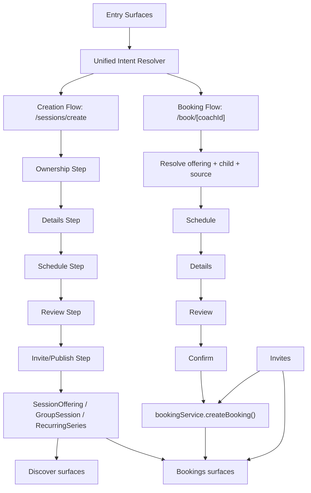

# Booking & Sessions Sprint 9: Unified Club-Coach Operating Model

**Date**: 2026-03-04
**Status**: Proposed (execution-ready)
**Spines**: Booking/Revenue + Development + Trust/Ops + Community/Growth

Detailed normal-booking entry-path UX spec:
- `docs/newsprints/booking-sessions/sprint9-normal-booking-e2e-ui.md`

## 1) Direct answer: Is club-admin session creation aligned with normal coach creation?

Short answer: **partially**.

What is already unified:
- Club-admin and coach can both launch into the same canonical screen: `/sessions/create`.
- Group creation redirect (`/group-sessions/create`) and session-invite redirect (`/session-invites/create`) both route into `/sessions/create`.
- Ownership lineage fields are carried in core create paths (`actingAs`, `clubId`, `ownerCoachId`, `assigneeCoachId`, `createdByUserId`, `createdByRole`).
- Invite acceptance routes through `bookingService.createBooking()` (single booking create authority).

What is not fully unified yet:
- `/sessions/create` has a **split implementation**:
  - `mode='new'` uses reusable step components (`CreateDetailsStep`, `CreateScheduleStep`, `CreateReviewStep`, `CreateInviteStep`).
  - `mode='existing'` renders a separate `ExistingInviteFlow` with bespoke UI/state.
- Manage console (`/manage/bookings`) introduces separate ownership-selection UI logic from `CreateDetailsStep` ownership controls.
- Alerts are still mixed with in-app components in critical create/invite paths, causing inconsistent UX.
- Discovery -> booking is now mostly unified through `/book/[coachId]`, but session creation surfaces still have duplicated state orchestration for ownership and invitation.

Conclusion:
- **Data lineage is mostly unified.**
- **UI/state orchestration is not yet fully unified.**
- Next sprint should unify at the component + state-machine layer, not create another flow.

---

## 2) Role-by-role product perspective (how people actually use this)

## A. Independent Coach (no org context)
Primary intent:
- Create sessions quickly, fill them, track attendance, convert to repeat bookings.

Primary surfaces:
- `/(tabs)/bookings` (My Sessions + coach quick actions)
- `/sessions/create` (new or existing invite)
- Session detail modal (capacity, off-platform attendees, management)
- `/manage` and `/manage/bookings` (optional ops console)

Expected mental model:
- "I create a session once, invite or publish, and all downstream states update everywhere."

Success criteria:
- Minimal clicks to create + publish.
- No duplicate records.
- Clear visibility of who is attending and what is paid.

## B. Club Coach (assigned by club)
Primary intent:
- Deliver sessions assigned by club, keep roster quality high, avoid ownership confusion.

Primary surfaces:
- `/manage/bookings` for assignment context
- `/sessions/create` with `actingAs='club'`
- Bookings list with ownership labels and assignment visibility

Expected mental model:
- "I can run club sessions without breaking ownership or parent visibility."

Success criteria:
- Assignee and owner always visible.
- Reassignment is safe/audited.
- Club-wide and assigned-only session scopes are obvious.

## C. Club Admin / Head Coach / Owner
Primary intent:
- Operate capacity at club level: assign coaches, create club sessions, send invites, monitor conversion.

Primary surfaces:
- `/manage`
- `/manage/bookings`
- `/sessions/create` (as self vs club)
- Club Hub for membership/ops context

Expected mental model:
- "One control tower. I pick ownership once and launch any session operation."

Success criteria:
- One ownership control pattern reused everywhere.
- No ambiguity over who owns delivery vs who created.
- Safe permission gating for POST_AS_ACADEMY / CREATE_SESSIONS.

## D. Parent
Primary intent:
- Find relevant sessions/coaches fast, book for child with confidence, track progress and trust signals.

Primary surfaces:
- `Bookings > Discover`
- `/discover-sessions`
- `/book/[coachId]/*` wizard
- Invites + booking detail + review

Expected mental model:
- "If I tap a session in discover, the app should already know the key details and move me forward."

Success criteria:
- No unnecessary re-entry of known info.
- Invite actions are immediate and obvious.
- Booking and payment expectations are clear before confirm.

## E. Athlete (self-booking)
Primary intent:
- Self-serve booking and progression with low friction.

Primary surfaces:
- same discovery/book flows as parent, without child-selection complexity

Expected mental model:
- "I can book myself quickly and see it reflected in sessions and development."

Success criteria:
- Smart defaults for self target.
- Fast review/confirm path.
- Progress and coach feedback loop closes cleanly.

## F. Admin / Support / Safeguarding
Primary intent:
- Preserve trust, enforce policy, and support issue resolution with full auditability.

Primary surfaces:
- manage/admin surfaces + route access constraints + service-level policy checks

Success criteria:
- No privilege leakage via list endpoints.
- Sensitive actions auditable.
- Idempotent write flows reduce duplicated/faulted operations.

---

## 3) Club -> Coach relationship model (practical operating reality)

There are two parallel truths that must be visible in UI and persisted in data:

1. **Business ownership** (club context)
- `actingAs='club'`
- `clubId`
- `createdByUserId` / `createdByRole`

2. **Delivery ownership** (coach context)
- `ownerCoachId`
- `assigneeCoachId`

Operationally, this means:
- A club admin can create on behalf of club.
- A coach can be assigned later (or reassigned).
- Parents should still see a coherent "coach delivering" identity plus club context.
- Bookings, invites, session detail, and earnings reconciliation must all preserve these fields.

If these fields are hidden or inconsistent across surfaces, trust collapses (parents), accountability collapses (club), and workload routing collapses (coaches).

---

## 4) End-to-end flow map (unified target)

Principle:
- **One resolver per domain** (create-intent resolver, booking-intent resolver).
- **One state machine per domain** (session-create machine, booking machine).
- **One write authority per entity type** (`createBooking`, group create/publish, recurring create).

---

## 5) Bilateral booking + creation case matrix (all practical cases)

## A. Direct creation by coach
- Surface: coach quick actions, manage, sessions/create new.
- Output: offering/group/recurring records + optional invites.
- Must appear in: coach bookings, discover (if open), session detail, manage console.

## B. Club-admin creation on behalf of club
- Surface: manage bookings -> create direct/group.
- Required choices: club + assignee.
- Output: same entities, with club lineage fields set.
- Must appear in: assigned coach view, owner view, club-relevant parent discover if eligible.

## C. Invite to existing session
- Surface: sessions/create existing.
- Source options: assigned-coach sessions or club-wide sessions.
- Output: session invites grouped by parent, later booking linked on accept.

## D. Discover-origin booking
- Surface: discover feed/sessions/map/session-detail modal.
- Expected behavior: prefilled context, no unnecessary step resets.
- Output: draft progression then `createBooking`.

## E. Invite acceptance booking
- Surface: discover invites + invites list + invite detail.
- Required behavior: booking creation first, invite status second (already in service).
- Output: linked invite/booking, notifications, state refresh.

## F. Group/club registration path
- Surface: group session detail and discover projections.
- Output: registration + booking linkage; reflected in bookings and capacity views.

## G. Recurring series path
- Surface: session create recurring + recurring acceptance.
- Output: recurring contract + generated bookings + visible lineage.

---

## 6) Edge-case checklist (must pass)

## Identity and role
- Multi-role user (coach + parent) chooses explicit acting context for sensitive flows.
- Parent-like athlete account can still self-book when allowed.
- Club admin lacking `POST_AS_ACADEMY` cannot post as club.

## Ownership and assignment
- Club-owned session with missing assignee is blocked where required.
- Reassignment updates all downstream projections.
- Owner/assignee changes are audit-tracked and visible in detail.

## Capacity and timing
- Slot becomes unavailable between view and submit.
- Invite accepted after expiration or capacity reached.
- Recurring weekly/biweekly date math across month boundaries.
- Camp multi-day range > policy max is blocked.

## Data consistency
- Discover and bookings show same canonical session offering identity.
- Group/event projections do not duplicate base offerings.
- Invite acceptance never leaves orphan ACCEPTED invite without booking.

## Parent and child context
- Multi-child parent active-child filter must scope discover and bookings consistently.
- Child age restrictions enforced on offered sessions.
- Child not selected: deterministic defaulting rules.

## Payment and reconciliation
- Off-platform payment state visible in booking detail + coach reconciler.
- Payment text appears as operational info, not confusing CTA noise.
- Disputed/unpaid states route to clear actions.

## Safety and trust
- DBS/safeguarding gate blocks where policy requires.
- Blocked relationships cannot book/message/discover each other.
- Sensitive data only visible by policy (guardian/participant/authorized coach).

## UX reliability
- No system alerts for routine actions (use in-app popups/alert component).
- Success feedback is short-lived, non-sticky, and state refresh is immediate.
- Back/forward navigation preserves wizard state predictably.

---

## 7) Reusable component contract (remove bollox/duplication)

Do not build parallel screens. Build reusable blocks and compose.

## Required shared components
- `OwnershipSelector`
  - Used by: manage console, create details, existing-invite flow.
  - Props: `postingAs`, `clubOptions`, `selectedClubId`, `assigneeOptions`, `selectedAssigneeId`, permission flags.

- `SessionTargetSelector`
  - Used by: create invite step, existing invite flow.
  - Props: target athletes, grouping mode (by parent), select-all behavior, filters.

- `SessionSourcePicker`
  - Used by: existing invite flow and future reassignment/attach flows.
  - Props: assigned vs club-wide scope, source list, selected source.

- `FlowFeedback` (in-app popup/toast/modal)
  - Replace routine `Alert.alert` calls in create/invite/booking flows.
  - Severity levels + action model + auto-dismiss policy.

- `BookingIntentResolver` + `CreateIntentResolver`
  - One per domain, no duplicate route heuristics in multiple hooks.

## State-machine split
- `bookingFlowMachine`
  - states: `entry_resolve -> type -> schedule -> details -> review -> submit -> confirmation`.
- `sessionCreateMachine`
  - states: `intent -> ownership -> details -> schedule -> review -> invite_publish -> complete`.

Both should be serializable and restorable for interrupted flows.

---

## 8) Security and governance model for this sprint

Minimum enforceable controls:
- Permission checks for club actions must be service-level, not only UI-level.
- Idempotency on write endpoints (booking create, invite response, publish transitions).
- Role + grant + resource scoped filters on list/read APIs.
- Audit events for ownership changes, invite responses, booking lifecycle writes.
- Sensitive reads and safeguarding-relevant writes logged with explicit action names.

Policy baseline:
- Club membership alone does not grant coach-private data access.
- Delegate access via explicit grants/scopes.
- Every reassignment is audit-visible.

---

## 9) Metrics framework (with sub-metrics)

This extends Sprint 8 metrics with explicit club->coach operational depth.

## M1. Session creation funnel
- M1.1 Start rate by source (`bookings_quick_action`, `manage_console`, `club_hub`, `redirect`).
- M1.2 Ownership step completion rate.
- M1.3 Club-posting failure rate (permission/assignee missing).
- M1.4 Step latency by step (`details`, `schedule`, `review`, `invite`).
- M1.5 Abandonment rate by step and role.

## M2. Ownership integrity
- M2.1 % created sessions with full ownership tuple populated.
- M2.2 Assignee null rate for club-owned sessions.
- M2.3 Reassignment success/failure rate.
- M2.4 Ownership mismatch incidents (detail vs listing inconsistency).

## M3. Discover -> booking conversion
- M3.1 Offering tap -> flow start.
- M3.2 Flow start -> review reached.
- M3.3 Review -> booking created.
- M3.4 Prefill coverage (% flows entering past step1 automatically when context exists).
- M3.5 Regression metric: Step1 fallback rate for discover-origin entries.

## M4. Invite system health
- M4.1 Invite send success rate.
- M4.2 Parent response distribution (accept/decline/counter/expire).
- M4.3 Invite->booking link success.
- M4.4 Booking-create failure on accept (should trend to zero).

## M5. Club-coach capacity ops
- M5.1 Assigned sessions per coach per week.
- M5.2 Unassigned club sessions count and aging.
- M5.3 Capacity saturation rate (full sessions / total active).
- M5.4 Waitlist promotion conversion.

## M6. Parent quality metrics
- M6.1 Time-to-book median.
- M6.2 Slot conflict encounter rate.
- M6.3 Cancellation within 24h rate.
- M6.4 Review submission rate after completion.

## M7. Trust and safety
- M7.1 DBS block events per 1k attempts.
- M7.2 Block-relationship action denials.
- M7.3 Sensitive access denial/success by role.
- M7.4 Audit coverage % for critical writes.

All metrics must be dimensioned by:
- `role`, `actingAs`, `clubId`, `ownerCoachId`, `assigneeCoachId`, `source`, `surface`, `inviteType`, `deviceClass`, `week`.

---

## 10) Execution plan (no parallel flows)

## Phase 1 (P0): Single ownership UI + state convergence
1. Extract `OwnershipSelector` from existing duplicated screens.
2. Replace `ExistingInviteFlow` ownership UI with shared component.
3. Replace manage-console ownership selection with same component.
4. Add one serialization model for create intent and ownership context.

## Phase 2 (P0): Existing-invite path decomposition
1. Break `ExistingInviteFlow` into reusable step components.
2. Reuse `SessionTargetSelector` and `SessionSourcePicker`.
3. Move all submit logic into hook/service orchestrator.

## Phase 3 (P1): In-app popup standardization
1. Introduce `FlowFeedback` component (success/error/confirm).
2. Migrate `Alert.alert` in create/invite/booking critical paths.
3. Enforce short-lived confirmations and immediate data refresh.

## Phase 4 (P1): Instrumentation + acceptance gates
1. Add event emission for each step transition and failure reason.
2. Add dashboard slices for club-admin vs coach vs parent.
3. Add regression gate on discover Step1 fallback.

---

## 11) Acceptance criteria (product + technical)

- Club-admin and coach create sessions through same step components and same state machine.
- Existing-invite flow no longer contains bespoke ownership picker logic.
- All create/write flows preserve ownership tuple and pass integrity checks.
- Discover-origin booking prefill skip rate improves and Step1 fallback rate drops.
- Invite accept/counter paths always create booking before status mutation.
- In-app popup feedback replaces routine alerts in target flows.
- Security checks (permission + audit + idempotency expectations) pass for club paths.

---

## 12) Risks if not done

- Club operations remain fragile due to duplicated state logic.
- Parent booking UX continues to feel inconsistent across entry points.
- Ownership confusion causes support burden and trust issues.
- Metrics become noisy/unreliable because flow states are not canonical.
- Security posture remains partially UI-enforced rather than service-enforced.

---

## 13) Devil's-Advocate Update (same-day deeper audit)

What this deeper pass found:

1. Multi-week path had a real lineage bug (now patched)
- It previously hardcoded coach/session labels and default athlete context.
- It now reads booking draft context and selected child context.

2. Discover remains split across multiple orchestration layers
- `Discover Sessions`, `Bookings > Discover`, and `Parent home discover` still run different data/controller logic.
- This is the biggest remaining reason for inconsistent booking entry behavior.

3. Invite surfaces still carry many native-alert interactions
- Booking/invite-critical actions should complete migration to in-app alert/feedback components.

4. "Coach Review Pending" lifecycle still lacks a user-facing timeout/SLA model
- Labeling is coherent but can persist long enough to feel broken from parent perspective.

Execution implication:
- Keep the Sprint 9 architecture direction.
- Prioritize convergence work in this exact order:
  1) discover-controller unification
  2) invite alert migration
  3) pending-review lifecycle policy

---

## 14) File anchors used for this report

- `/app/sessions/create.tsx`
- `/hooks/use-create-session.ts`
- `/app/manage/index.tsx`
- `/app/manage/bookings.tsx`
- `/hooks/use-manage-bookings.ts`
- `/app/group-sessions/create.tsx`
- `/app/session-invites/create.tsx`
- `/app/book/[coachId]/index.tsx`
- `/app/book/[coachId]/details.tsx`
- `/app/book/[coachId]/review.tsx`
- `/app/book/[coachId]/confirmation.tsx`
- `/hooks/use-bookings.ts`
- `/hooks/use-bookings-discover.ts`
- `/services/invite/session-invite-service.ts`
- `/services/booking/booking-crud-service.ts`
- `/docs/SOURCE_OF_TRUTH.md`
- `/docs/backend-api/AUTHZ_AUDIT_AND_SECURITY.md`
- `/docs/backend-api/DATA_MODEL_AND_IDENTIFIERS.md`
